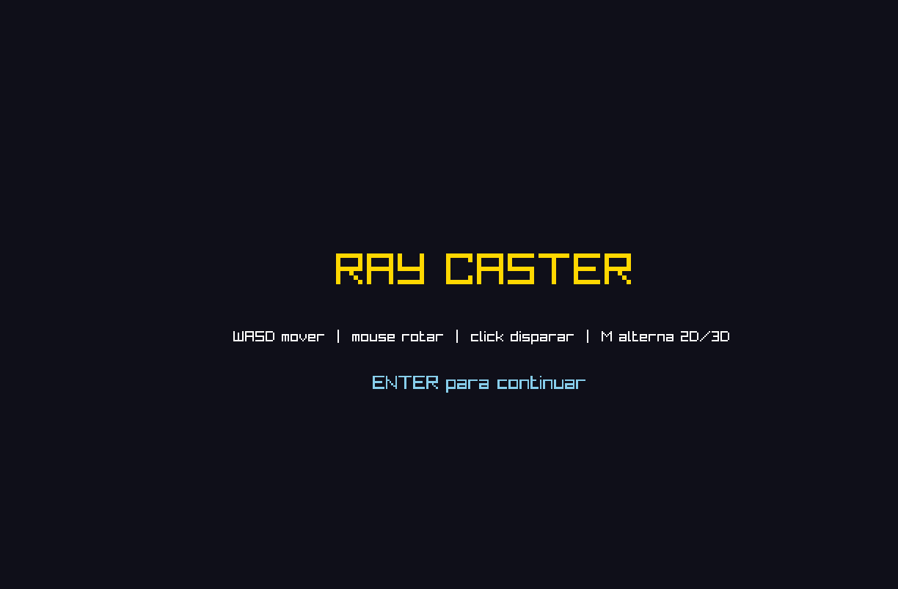
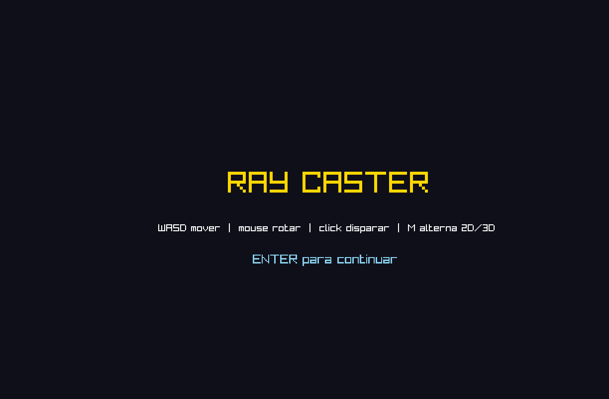
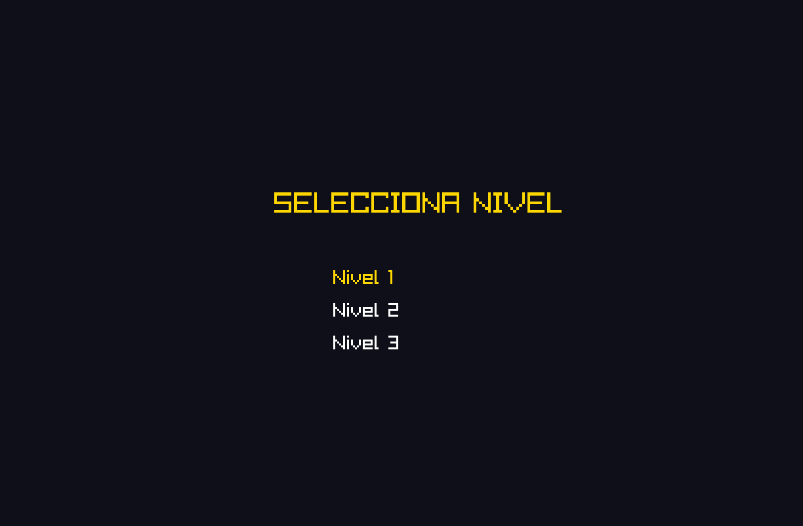
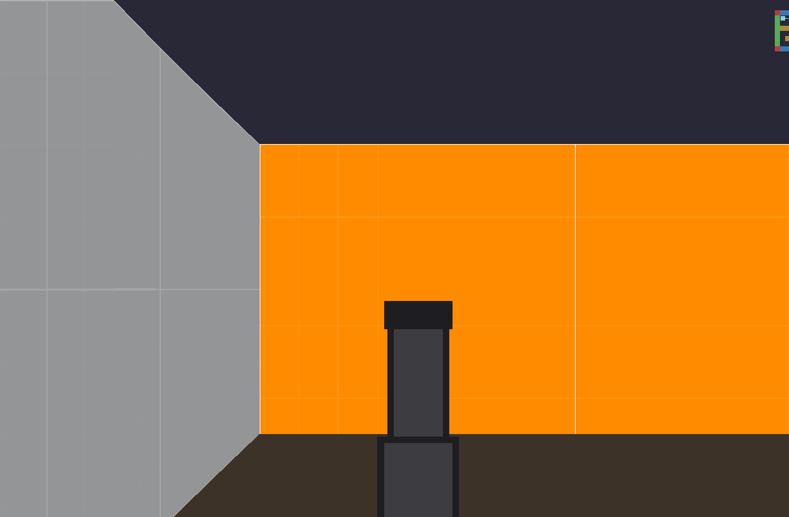
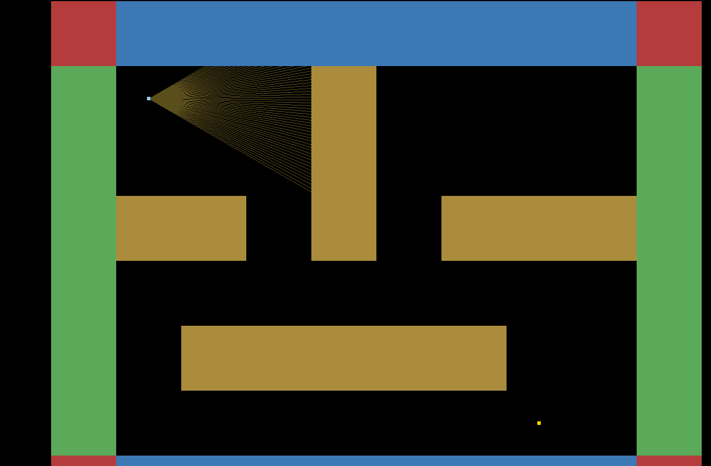

# Proyecto Raycast

Ray caster estilo Wolfenstein 3D hecho en Rust con [raylib](https://github.com/raysan5/raylib).
Todo el render del mundo (paredes, sprites, minimapa) se escribe pixel a pixel a un framebuffer
propio; raylib solo se usa para ventana, input, audio y texto de las pantallas de menu.



## Compilacion

Requiere Rust (edicion 2021) y las dependencias de build de `raylib-sys` (CMake y un compilador
de C/C++; en Windows, MSVC Build Tools).

```
cargo build --release
cargo run --release
```

## Controles

| Accion             | Teclado / mouse          | Gamepad                    |
|---------------------|---------------------------|-----------------------------|
| Moverse              | WASD                       | stick izquierdo             |
| Rotar camara          | mouse (eje X)              | stick derecho (eje X)       |
| Disparar               | click izquierdo             | boton A / Cross              |
| Alternar 2D/3D          | M                          | -                            |
| Confirmar / continuar    | ENTER                      | -                            |
| Navegar seleccion de nivel | flechas arriba/abajo     | -                            |

## Capturas

| Bienvenida | Seleccion de nivel |
|---|---|
|  |  |

| Render 3D | Debug 2D (tecla M) |
|---|---|
|  |  |

## Niveles

`levels/level1.txt` es un mapa hecho a mano. `level2.txt` y `level3.txt` son laberintos
generados con backtracking recursivo (garantiza un unico camino entre el spawn `p` y la meta
`g`), con enemigos `e` distribuidos en celdas abiertas al azar.